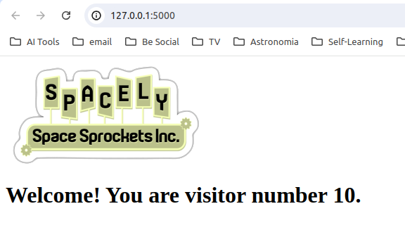

# DevOps-Workshop
This is a good end-to-end exercise to practice infrastructure as code and some DevOps tools. 

# Application
A simple web app in Python. This app will count unique visitors, and store data in PostgreSQL.

# Infrastructure as code.
Any necessary cloud resource will be deployed on **Azure** using **Terraform**.
- Azure EKS
- Postgresql
- Azure Container Registry
- Storage account for Terraform backend

# Local development and test
The container DB image for local development and initial test will be done with **Docker** with a official postgres image.

# CI/CD
- Was done with GitHub actions, due to its simplicity.

Here is how it looks.

# Monitoring
 monitoring hasn't been implemented yet. 
