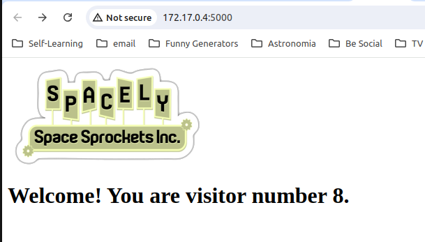

# Development Process
here are the steps I would follow:

### First
- Build a minimum viable product.
forget about the database create a basic app, *that does the work*, _"quick and dirty"_ don't get distracted with de Database with a simple csv file.

### Second 
- Containerize it! this version 
now that is working, later we can add more features like database connection.

### Third Step
- Add important and mandatory feature
    - adding the version endpoint and a simple file to store it.
    - switch from flat text to DB

### 4th step
Now that the application is doing the 2 basic actions we expected let's publish our image in a container registry.

We will try to give preference to any azure tool 

I'm assuming you have an Azure account you can get one for free (for this lab.)

`bash`

`az login`

`az acr create --resource-group myResourceGroup --name myContainerRegistry --sku Basic`

Let's do thing manually first to confirm everithing is working fine.

let's login into our recently created conteainere registry

`az acr login --name myContainerRegistry`

btw: I called my containerregistry as the company form the Jetsons Cartoon, use the name you want.

`You may want to use 'az acr login -n spacelysprockets --expose-token' to get an access token, which does not require Docker to be installed.
2024-06-25 22:23:18.198144 An error occurred: DOCKER_COMMAND_ERROR
permission denied while trying to connect to the Docker daemon socket at unix:///var/run/docker.sock: Get "http://%2Fvar%2Frun%2Fdocker.sock/v1.45/containers/json": dial unix /var/run/docker.sock: connect: permission deniedcode`

➜  ~ az acr login --name spacelysprockets --expose-token

You can perform manual login using the provided access token below, for example: 'docker login loginServer -u 00000000-0000-0000-0000-000000000000 -p accessToken'
{
  "accessToken": "eyJhbGci-----LONG-TOKEN-RECEIVED----Oihm_BRE-A",
  "loginServer": "spacelysprockets.azurecr.io"
}

I saved the token in a environment variable

`acracesstoken="ci-----LONG-TOKEN-RECEIVED---m"`

`docker login loginServer -u 00000000-0000-0000-0000-000000000000 -p $acraccesstoken`

being back on my project main directory will refresh the env variable with the app version.

`VERSION=$(cat app/version.txt)`

pay attention to the tag
`sudo docker build --build-arg VERSION=$VERSION -t spacelysprockets.azurecr.io/visitor-counter:$VERSION -f app/Dockerfile app`

you will see the usual message from docker rebuilding your container images.

*[+] Building 1.8s (9/9) FINISHED*

Let's push manually this time our container image, later this will be done by the pipeline.

`docker push spacelysprockets.azurecr.io/visitor-counter:$VERSION
`

`code`
`code`
`code`
`code`
`code`
